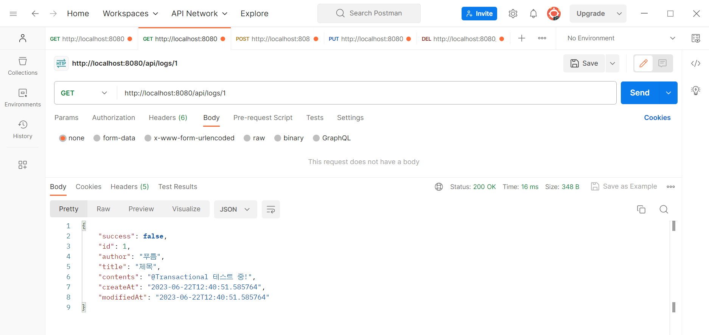
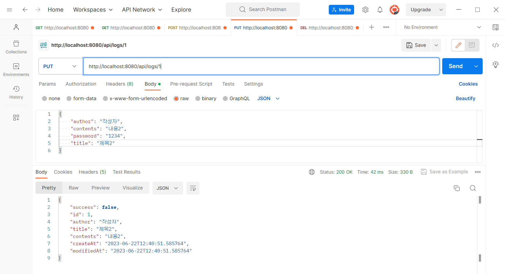
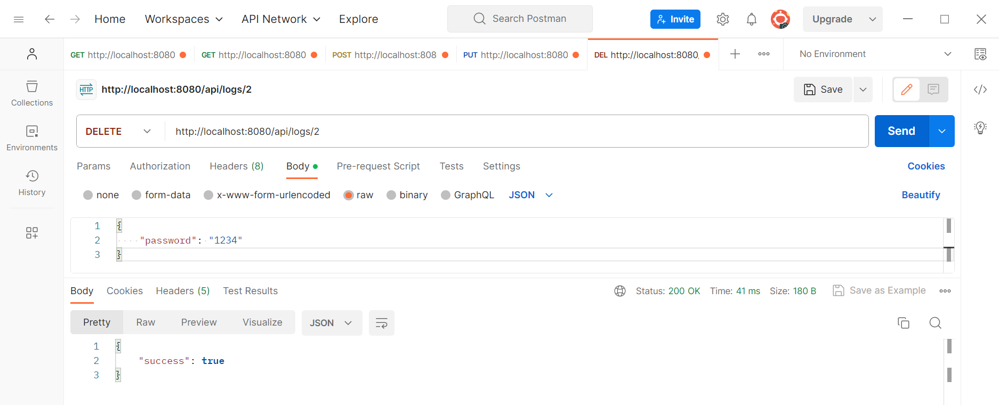

# **BLOG_CRUD**
 
✔ **요구사항**

## 1. 아래의 요구사항을 기반으로 Use Case 그려보기

팀원분이 😳 [draw.io](https://app.diagrams.net/) 라는 꿀앱을 알려주셔서 쉽게 그릴 수 있었다!

---

## 2. 전체 게시글 목록 조회 API

- 제목, 작성자명, 작성 내용, 작성 날짜를 조회하기
- 작성 날짜 기준 내림차순으로 정렬하기

postman을 활용하면 결과를 쉽게 확인할 수 있다.\
사용법을 잘 모르겠어서 시간을 허비했다.

---

## 3. 게시글 작성 API

- 제목, 작성자명, 비밀번호, 작성 내용을 저장하고
- 저장된 게시글을 Client 로 반환하기

---

## 4. 선택한 게시글 조회 API

- 선택한 게시글의 제목, 작성자명, 작성 날짜, 작성 내용을 조회하기
- 글번호로 조회

---

## 5. 선택한 게시글 수정 API

- 수정을 요청할 때 수정할 데이터와 비밀번호를 같이 보내서 서버에서 비밀번호 일치 여부를 확인 한 후
- 제목, 작성자명, 작성 내용을 수정하고 수정된 게시글을 Client 로 반환하기

---

## 6. 선택한 게시글 삭제 API

- 삭제를 요청할 때 비밀번호를 같이 보내서 서버에서 비밀번호 일치 여부를 확인 한 후
- 선택한 게시글을 삭제하고 Client 로 성공했다는 표시 반환하기

---

## API 명세서

---
### 부족한 부분
- postman 활용 : 팀원들의 도움으로 잘 활용할 수 있게됨
- API 명세서 작성 : 튜터님 피드백 👀 [REST API URL 컨벤션 Top5](https://blog.pumpkin-raccoon.com/115) 참고하여 수정
- github 활용 : 두 개의 계정 활용해 연습
- @Transaction 전파 부분 : 강의 반복수강

