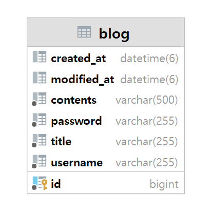

# SPRING.V1

"스프링 부트로 로그인 기능이 없는 나만의 블로그 백엔드 서버 만들기"

[Notion 바로가기](https://www.notion.so/verdureko/Spring-Lv-1-f852c5d02cda474bb69c52aed25e397e)

## UseCase

## ERD

## API 명세서

1. 수정, 삭제 API의 request를 어떤 방식으로 사용하셨나요? (param, query, body)

   @RequestBody

2. 어떤 상황에 어떤 방식의 request를 써야하나요?

   `create` API

    - 방식: **`POST`** 메서드
    - Request Body: 새로운 리소스를 생성하기 위한 데이터
    - 주로 JSON 또는 XML 형식으로 데이터를 전송하여 요청 본문에 포함시킵니다.

   `get` API

    - 방식: **`GET`** 메서드
    - Request Parameter 또는 Query Parameter: 요청하는 리소스의 식별자 또는 필터링에 사용되는 매개변수
    - 주로 URL에 쿼리 파라미터 형태로 전달합니다.

   `update` API

    - 방식: **`PUT`** 또는 **`PATCH`** 메서드
    - Request Body: 업데이트할 리소스의 데이터
    - 리소스의 전체 업데이트인 경우에는 **`PUT`** 메서드를 사용하며, 일부 업데이트인 경우에는 **`PATCH`** 메서드를 사용합니다.

   `delete` API

    - 방식: **`DELETE`** 메서드
    - Request Parameter 또는 Query Parameter: 삭제할 리소스의 식별자 또는 필요한 매개변수
    - 주로 URL에 쿼리 파라미터 형태로 전달합니다.
3. RESTful한 API를 설계했나요? 어떤 부분이 그런가요? 어떤 부분이 그렇지 않나요?
    1. 삭제 API에 body를 사용했습니다.
4. 적절한 관심사 분리를 적용하였나요? (Controller, Repository, Service)
5. API 명세서 작성 가이드라인을 검색하여 직접 작성한 API 명세서와 비교해보세요!

